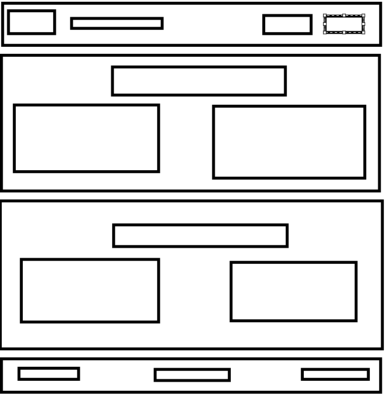
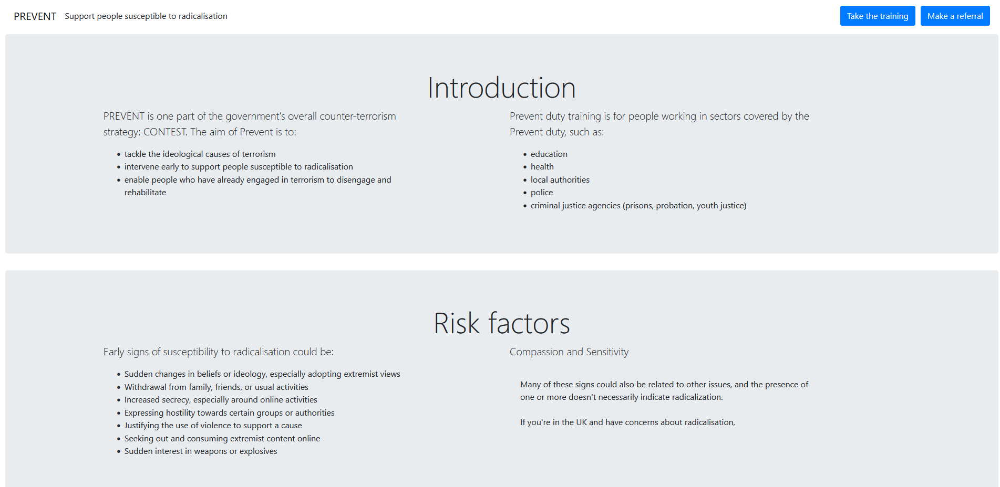
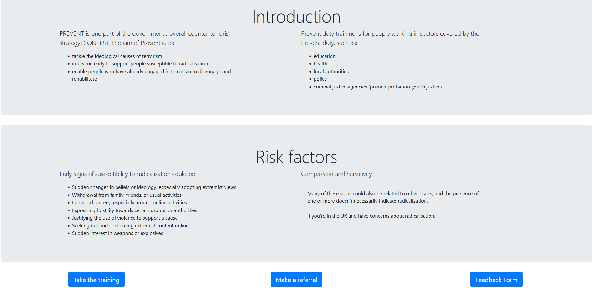

project 3 prevent training

This project is a formative assessment for Code Institute in which I'm building a one page website on the theme of PREVENT.
PREVENT is the UK governments' strategy for preventing radicalisation and for enabling people to disengage from radicalism.

This project will avoid provocative imagery and will be strong on textual information. This presents a UX challenge: 
to balance readability and visual clarity against the high word count. Text content on the website will be summarised from
official sources. Links will be provided to the relevant web pages.

The expected USER is somebody who works in a sector covered by the Prevent duty. 

Table of contents 

[EXTERNAL RESOURCES](#USER-STORIES)

[WIREFRAME](#WIREFRAME)

[WIP HEADER AND MAIN](#WIP-HEADER-AND-MAIN)

[WIP MAIN AND FOOTER](#WIP-MAIN-AND-FOOTER)

[UX DESIGN](#UX-DESIGN)

[DEPLOYED HEADER AND MAIN](#DEPLOYED-HEADER-AND-MAIN)

[DEPLOYED MAIN AND FOOTER](#DEPLOYED-MAIN-AND-FOOTER)

[DEPLOYED FEEDBACK](#DEPLOYED-FEEDBACK)

[VALIDATION](#VALIDATION)

[VALIDATION 2](#VALIDATION-2)

[EXTERNAL RESOURCES](#EXTERNAL-RESOURCES)

[USER STORIES ACHIEVED???](#USER-STORIES-ACHIEVED???)

### USER STORIES

As a site user I can access information on the Prevent strategy

(what it is and who it applies to laid out side by side)

As a user I can access information on risk factors

(the signs of radicalisation laid out in a list alongside a sensitivity warning)

As a site user I can access said information in discrete sections

(concise lists with headings)

As a site user I can follow links to other pertinent government resources

As a site user I can follow a link straight to PREVENT training

(links provided in menu and in footer)

As a site user I can follow a link straight to PREVENT reporting

(links provided in menu and in footer)

As a jr developer I would like feedback from my users

(feedback form linked in footer)

### WIREFRAME

### WIP HEADER AND MAIN

### WIP MAIN AND FOOTER

### UX DESIGN

Colour palette: 

hex: 

#fafafa

presets:

tomato
bisque
aqua

Typography: arial, helvetica

Images: credited in page

### DEPLOYED HEADER AND MAIN

### DEPLOYED MAIN AND FOOTER

### DEPLOYED FEEDBACK

### VALIDATION

First Attempt:

CSS passed validation with no errors

HTML did not pass validation. Early in the project I encountered an issue where my background image was not covering the whole page.
Resolved by adding a class to the body. This image was too bright, and so I intended to darken with an overlay.

Having seen such a thing done before I tried to emulate it but ALAS it would not cover the image. Resolved with some tweaked CSS attributes
and some divs left unclosed.

I will return to this problem. It has been suggested that I return to body and apply a :before psuedo class. I will make an attempt 
before the deadline. 

### VALIDATION 2

I used a pseudo class for the bg class, and was able to successfully deploy the background image and overlay as a class inside the opening body tag. 
html and css validation passed.

### EXTERNAL RESOURCES

I used Claude AI to summarise the Prevent guidance from the UK government's website.

I had used w3 schools to create a full page background image (https://www.w3schools.com/howto/howto_css_full_page.asp)

Although my code still looks a lot like that on w3, it has gone through a lot of iterations and my trials with unvalidated

 elements have left me with a sense of authorship that it's tough to let go of.

I used stack overflow (https://stackoverflow.com/questions/34702477/add-a-dark-overlay-to-background-image/34702639#34702639) to 
help the opaque overlay and background image pass validatoin. Their solution included a linear colour gradiant with opacity as a 
separate attribute. I deleted the opacity and background image attribute, and combined them into background-color: rgba(0,0,0,.5).

### FURTHER TESTING

I have accessed the deployed product on Firefox and Chrome on PC and iPhone. It responds as hoped. I have changed my screen orientation on mobile.

### USER STORIES ACHIEVED???

The website does contain information about prevent. It is clearly headed and legible. There are working links. 

Accessing government resources: there is an array of pdf's and documents on the subject. I want my website to be clean and have adjudged the 
call to action buttons to be sufficient. The NSPCC represents a "third way" I hope.

The feedback form is unstyled, and leads to nowhere. I had considered implementing some JS to make it work but eh maybe next time.

The colour contrast is fine but the form is too bright. The nav-brand could be bigger. 

